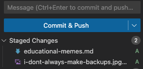

# How do I do this? I need help!
Want to share your own nugget of wisdom or funny meme? Awesome! We look forward to reading it! Follow the below steps.

### 1. Fork this repository
As expected you don't have permission to change this repository, so let's fix that.
Forking the repository will make a copy of it on your account, which you will then have permission to modify.

1. In the top right of this page, click the **Fork** button.
1. On the **Create a new fork** page, leave all the details the same. Click **Create fork**.


### 2. Create a branch
Let's create our own place to start making changes.

1. Navigate to your forked copy of this repo.  
Something like https://myusername/webinars-playground
1. Above the list of files, on the left side, expand the list of branches.
1. Enter a new branch name and it will off to create the new branch since it does not exist.
    - Suggestion: `<initials>/add-coding-meme/<description>`
    - Example: `cwb/add-coding-meme/making-backups`

### 3. Open the online code editor
GitHub makes editing simple text files super easy. You don't even need to have a code editor installed!

1. Navigate to your forked copy of this repo.  
Something like https://myusername/git-gud-guidelines
1. Ensure you are on your new branch.
    - Above the list of files, on the left, expand the list of branches and select your branch.
2. Press the period key `.` on your keyboard.
    - The page will refresh and Visual Studio Code will open in your web browser.
    - Confirm in the lower status bar, on the left, that your branch name is shown. If no, select the branch name ans switch.

>[!TIP]
> You can also open the online code editor by changing `.com` to `.dev` in the url.

### 4. Open the meme's page
Some things need 1000 words to be properly understood.
Let's open the page with existing memes, so we can add our own.

1. In Visual Studio Code, on the left navigation bar, select the file explorer tab (top icon).
1. Locate the file `educational-memes.md` and open it.
1. Locate the folder `educational-memes` and open it.

### 5. Add your favorite coding meme
It's time to change something! :) 

1. Find and download your favorite Meme. Alternately, use a generator to create one. For example [ImgFlip](https://imgflip.com/memegenerator).
    1. Use the search to find a popular base image.
    1. Add your perfectly crafted awesome text.
    1. Click generated and download the image locally.
1. Open meme with an image editor and resize to max 200x200 pixels.
1. Back in VS Code drag your image file into the `educational-memes` folder. Make sure it has a unique name.
1. In the `educational-memes.md` file, add markdown to display an image. Example:
    ```md
    
    ```

### 6. Let's commit
Nice work! Now let's stage your changes and commit them to your branch.

1. In Visual Studio Code, on the left navigation bar, select the version control tab (usually 3rd icon from top).
1. Under the list, hover over your image file and modified `educational-memes.md` file. Press the plus `+` sign on each to put them in the staged area.
    
1. In the **Message** box, add a short non-generic description of your meme. Example: `Add meme about making backups.`
1. Click **Commit & Push**.

### 7. Create the Pull Request
Almost done. We just need to request our change to be pulled from our repo into the original. A pull request!

1. Navigate to your forked copy of this repo.  
Something like https://myusername/git-gud-guidelines
1. At the top, select the **Pull requests** tab.
1. At the top right, click the green **New pull request** button.
1. Ensure the base and compare branches are correct.
    - base repository: `chriswblake/git-gud-guidelines` base: `main`
    - head repository: `myusername/git-gud-guidelines` compare: `<initials>/add-coding-meme/<description>`
1. Click the green **Create pull request** button.
1. If needed, enter a brief description to help the reviewer understand your work.
1. Wait for feedback or the pull request to be accepted and merged! All done!
    - A good description will enable quick feedback and less time to accept the merge.
    - A good description will be your portfolio for building trust in future interactions.

# I don't have any ideas... please help!
This is a playground, so you can submit most anything you like. Just be respectful and make sure it has at least a small educational nugget.

- If a section is missing, create it.
- Find a typo, fix it.
- Something wrong with the guide. Fix it.
- Find the best coder meme ever, share it.
- Find a funny joke that has a hidden truth, add it.

> [!TIP]
> Don't worry about your submission being perfect or being in the correct place. Refactoring and reorganizing is a natural. If necessary, I'll move it to the correct spot during your PR.